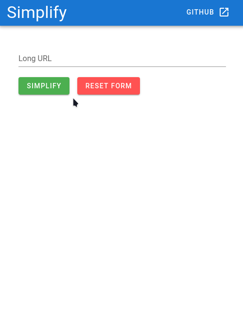
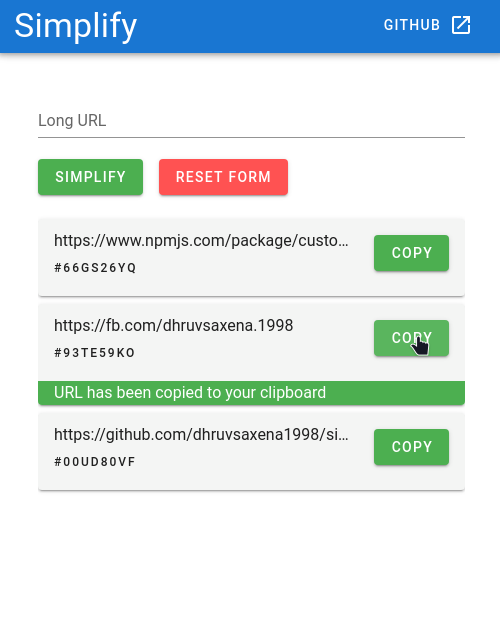

# Simplify

### Vue.js + Vuetify Application.

Simplify yours long URl's to 8-character short-id.

> Development

- front-end - `npm run serve`
- back-end - `npm run server`

> Production

- `npm run start`

---

### API

> Get all available links

<span style="color:#d93f44">**V2 Update [WIP] :**</span> &nbsp; `Enable authentication and dashboard for particular user`

<span style="color:#34eb52">**GET :**</span> &nbsp; `{{api}}/api/v1/url/`

##### Sample response

```json
[
  {
    "shortUrl": "00ud80vf",
    "views": 0,
    "_id": "5f1c51a04491455869a3bbce",
    "longUrl": "https://github.com/dhruvsaxena1998/simplify-vue",
    "__v": 0
  },
  {
    "shortUrl": "93te59ko",
    "views": 0,
    "_id": "5f1c51c84491455869a3bbcf",
    "longUrl": "https://fb.com/dhruvsaxena.1998",
    "__v": 0
  },
  {
    "shortUrl": "66gs26yq",
    "views": 0,
    "_id": "5f1c51d04491455869a3bbd0",
    "longUrl": "https://www.npmjs.com/package/custom-id",
    "__v": 0
  }
]
```

> Create Short Url

<span style="color:#d9a53f">**POST :**</span> &nbsp; `{{api}}/api/v1/url/`

##### Sample request body

```json
{
  "url": "https://google.com"
}
```

##### Sample response

```json
{
  "shortUrl": "97tm61ip",
  "views": 0,
  "_id": "5f1c59e20b8d08674e3c0e2b",
  "longUrl": "https://google.com",
  "__v": 0
}
```

> Redirect

<span style="color:#34eb52">**GET :**</span> &nbsp; `{{api}}/:shortId`

REDIRECTS TO LONG URL WEBSITE

---

#### Output



